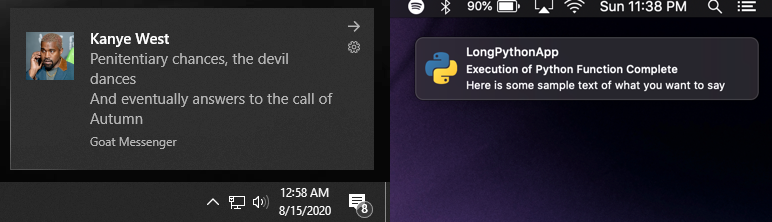

<div align="center">
<br>
  <h1> notify.py </h1>
  <i> Cross platform desktop notifications for Python scripts and applications.</i>
  <br>
  <br>
  <p align="center">
    
    
    
  </p>
  <br>
  <p align="center">
    
    
    
  </p>
    <p align="center">
      
    <h1>
  </p>
</div>


## Docs

You can read the docs on this Git's Wiki, or [here](https://ms7m.github.io/notify-py/)

## Supported Platforms.

- Windows 10
- macOS 10 >=10.10
- Linux (libnotify)

No dependencies are required other than loguru.

***


## Install

```
pip install notify-py
```

***

## Usage


**Send Simple Notification**
```python

from notifypy import Notify

notification = Notify()
notification.title = "Cool Title"
notification.message = "Even cooler message."
```

**Send Notification With Icon**
```python

from notifypy import Notify

notification = Notify()
notification.title = "Cool Title"
notification.message = "Even cooler message."
notification.icon = "path/to/icon.png"

notification.send()
```

**Send Notification With Sound**
```python

from notifypy import Notify

notification = Notify()
notification.title = "Cool Title"
notification.message = "Even cooler message."
notification.audio = "path/to/audio/file.wav"

notification.send()

```

**Sending Notifications without blocking**
```python

from notifypy import Notify

notification = Notify()
notification.send(block=False)

```


**Sending with Default Notification Titles/Messages/Icons**
```python

from notifypy import Notify

notification = Notify(
  default_notification_title="Function Message",
  default_application_name="Great Application",
  default_notification_icon="path/to/icon.png",
  default_notification_audio="path/to/sound.wav"
)

def your_function():
  # stuff happening here.
  notification.message = "Function Result"
  notification.send()
```

***

## Important Caveats 

- As it stands (May 18, 2020), this is simply a notification service. There is *no* support for embedding custom actions (buttons, dialogs) regardless of platform. Other then telling you if the shell command was sent, there is also no confirmation on user action on the notification. 

- macOS does **not** support custom icons on the fly.. You will need to bundle a customized version of the notifier embedded with your custom icon. 

***

### Windows Specific.

- No support for balloon tips (pre Win10).. This will be changed in the future.

***


### Contributors
- [Leterax](https://github.com/Leterax)
***
### Inspiration and Special Thanks

- https://github.com/go-toast/toast - Ported their Windows 10 toast notification to Python.

- [Vítor Galvão](https://github.com/vitorgalvao) for https://github.com/vitorgalvao/notificator

- https://notificationsounds.com/notification-sounds/done-for-you-612 example_notification_sound.wav

- https://github.com/mikaelbr/node-notifier

***

# Contributing
Contributions are welcome. 

- Tests are ran against all platforms.
- Black formatting is required.
